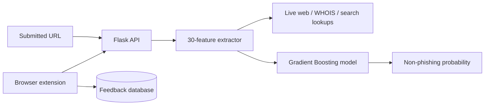

# Phishing URL Detection Model and Browser Prototype

An educational machine-learning project that extracts 30 URL and website features, scores a submitted URL with a serialized Gradient Boosting model, and experiments with browser-assisted feedback collection.

> [!WARNING]
> A prediction is only a heuristic signal, not a guarantee that a site is safe. The Flask service performs outbound lookups for user-supplied URLs and must not be exposed publicly without SSRF defenses, strict validation, timeouts, authentication, rate limits, and network egress controls.

## Components

- `Phishing URL Detection.ipynb` — exploration, feature analysis, and model comparison
- `feature.py` — URL, HTML, WHOIS, traffic, and search-derived feature extraction
- `pickle/model.pkl` — model loaded by the Flask application
- `app.py` — scoring and feedback endpoints
- `db/` and `database.db` — SQLite loading, feedback storage, and retraining helpers
- `chrome-extension/` — Manifest V3 browser prototype

## Architecture



## Run locally

Use an isolated environment and treat every tested URL as untrusted input:

```bash
git clone https://github.com/jayanth-mkv/phishing-links-detection-model.git
cd phishing-links-detection-model
python -m venv .venv
# Windows: .venv\Scripts\activate
# macOS/Linux: source .venv/bin/activate
pip install -r requirements.txt
python app.py
```

Score a URL through the form-encoded endpoint:

```bash
curl -X POST http://127.0.0.1:5000/ -d "url=https://example.com"
```

The response contains `prob_not_phishy`. Keep the service bound to a trusted local environment during evaluation.

## Browser extension status

The extension is an experimental companion, not a packaged release. Its scripts include a hard-coded hosted endpoint, so review and replace that URL before loading the extension unpacked. Do not send browsing data to an endpoint you do not control.

## Evaluation notes

The notebook records a best Gradient Boosting accuracy of `0.974` and comparison metrics for several classifiers. Those are historical notebook results; this README does not claim that they reproduce on current dependencies, unseen datasets, or live traffic.

## Limitations and security review

- Live feature extraction can be slow, brittle, privacy-sensitive, and vulnerable to malicious destinations.
- The code does not currently enforce safe URL schemes, public-address-only resolution, redirect limits, or request timeouts.
- Model artifacts loaded with pickle must only come from a trusted source.
- Dataset quality, class balance, leakage, drift, and adversarial evasion need renewed evaluation.
- The feedback endpoint needs authentication, validation, abuse protection, and provenance controls.

Keep this repository in the security-review set until those risks are addressed.
