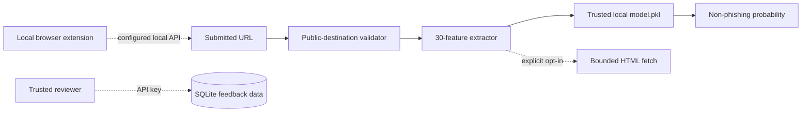

<div align="center">

# Phishing URL Detection Research Model

**An educational 30-feature URL classifier with a local Flask scoring API and an opt-in browser-extension prototype.**

[Quick start](#quick-start) · [Safety modes](#safe-url-processing) · [Architecture](#architecture) · [Extension](#browser-extension-prototype) · [Limitations](#model-and-security-limitations)

</div>

## What is it?

This repository explores phishing URL classification with lexical, domain, page-structure, and historical reputation features. A serialized Gradient Boosting model returns a `prob_not_phishy` value, while the notebook and dataset preserve the original experimentation and training context.

The result is a heuristic research signal—not a safety verdict. The default service mode avoids fetching the submitted page, so live-page features use the model's unavailable sentinel. That safer default also changes the feature distribution from the original training workflow and may reduce predictive quality.

## Quick start

Prerequisites: Python 3.9–3.11 is recommended for compatibility with the pinned scientific packages.

```bash
git clone https://github.com/jayanth-mkv/phishing-links-detection-model.git
cd phishing-links-detection-model
python -m venv .venv
source .venv/bin/activate
pip install -r requirements.txt
cp .env.example .env
python app.py
```

On Windows PowerShell, activate with `.venv\Scripts\Activate.ps1`. Environment files are not loaded automatically; export the values or use your preferred process manager when changing the defaults.

Score a public HTTP(S) URL:

```bash
curl -X POST http://127.0.0.1:5000/ \
  -H "Content-Type: application/json" \
  -d '{"url":"https://example.com"}'
```

The response includes the normalized URL, `prob_not_phishy`, and whether live network features were enabled.

## Architecture



Dashed paths are disabled until explicitly configured. Historical WHOIS, Alexa, PageRank, and Google-search calls are not made by the runtime service.

## Safe URL processing

Every scoring and feedback URL is validated before feature extraction:

- only `http` and `https` are accepted;
- embedded usernames/passwords and nonstandard ports are rejected;
- DNS must resolve exclusively to globally routable addresses;
- loopback, private, link-local, reserved, multicast, and unspecified addresses are rejected; and
- input length is capped at 2,048 characters.

With `ENABLE_NETWORK_FEATURES=false` (the default), no submitted page is downloaded. Lexical features still run and page-dependent features use their unavailable/error values.

With `ENABLE_NETWORK_FEATURES=true`, the fetcher additionally applies connect/read timeouts, a three-redirect cap, validation of every redirect destination, a 1 MB response cap, HTML-only content checks, and a fixed research user agent. Run this mode only in a disposable environment with network egress rules: application validation alone cannot completely eliminate DNS-rebinding, proxy, resolver, or lower-layer network risks.

## API and feedback

| Method | Path | Purpose | Limit |
| --- | --- | --- | --- |
| `GET` | `/` | Service mode/status | Global limit |
| `POST` | `/` | Score one URL | 10 requests/minute per client |
| `POST` | `/add_data` | Store reviewed `-1` or `1` feedback | API key + 5 requests/minute |

Feedback is disabled until `FEEDBACK_API_KEY` is set. Trusted reviewers must send the value in `x-feedback-api-key`. Do not put that key in a public browser extension.

The in-memory rate-limit backend is suitable only for local single-process evaluation. Configure a shared `RATELIMIT_STORAGE_URI` for multiple workers.

## Browser extension prototype

`phishy-plugin-chrome-extension/` is an unpacked Manifest V3 research companion. It is disabled by default and accepts only a local API origin permitted by the manifest.

After starting the Flask API, load the directory unpacked and opt in from the extension service-worker console:

```js
chrome.storage.sync.set({ apiBaseUrl: "http://127.0.0.1:5000" })
```

Remove that setting to stop checks. Scored URLs are cached in `chrome.storage.session`, not synchronized storage. The extension no longer submits feedback because it cannot safely hold the reviewer API key.

## Repository map

| Path | Role |
| --- | --- |
| `Phishing URL Detection.ipynb` | Historical exploration and model comparison |
| `feature.py` | Feature extraction with safe/offline defaults |
| `url_security.py` | Public-destination validation and bounded fetcher |
| `pickle/model.pkl` | Trusted local serialized classifier |
| `app.py` | Rate-limited Flask API |
| `db/` and `database.db` | Feedback and retraining helpers |
| `tests/` | URL-security regression tests |
| `phishy-plugin-chrome-extension/` | Opt-in local browser prototype |

## Model and security limitations

- A high score does not prove a URL or page is safe. Keep browser Safe Browsing, endpoint protection, sandboxing, and user review enabled.
- The notebook's historical metrics are not evidence of present-day performance. Re-evaluate with time-separated, deduplicated, adversarial, and representative datasets.
- Offline/default scoring leaves several live and reputation features unavailable; recalibration or retraining is required before comparing probabilities with the original experiment.
- Attackers can manipulate URL and page features, redirect behavior, DNS, content served by user agent, and site state over time.
- Pickle can execute code during loading. Use only the reviewed repository artifact and verify its provenance; never accept uploaded model files.
- Feedback labels need reviewer identity, provenance, deduplication, audit, rollback, and poisoning defenses before retraining.
- Do not expose the Flask development server directly to the internet. Use an isolated production WSGI server, TLS gateway, authentication, shared rate-limit storage, logging policy, and egress firewall for any controlled deployment.

## Validation

```bash
python -m py_compile app.py feature.py url_security.py db/save_data.py
python -m unittest discover -s tests -v
```

## License

No license file is currently included. Unless one is added, the repository remains under default copyright terms.
